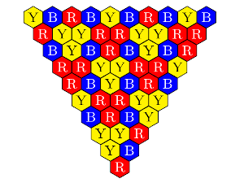

# A Formalization of The Three-Color Triangle Problem

## The three-color triangle problem

The three-color triangle problem is a mathematical quiz, which is given in the following setting:

- Consider regular hexagonal tiles arranged in an inverted triangle shape of *n* stages (the stage is counted from 0, namely, a 0-stage triangle contains one tile). 
- Paint the tiles in three colors (like red, blue, and yellow) so that any three adjacent tiles have the same color or all different colors.
- A colored triangle is called **well-colored** if the colors of its three vertices are the same or different.

The quiz asks to determine the general form of *n* such that a colored triangle of stage *n* is always well-colored. 
The answer of the quiz is already known, namely, it's *3^k*. 

 An example of a well-colored triangle with 9-stages. 

The three-color triangle problem is introduced in the following paper:
> Y. Nishiyama, ``The Three-Color Triangle Problem'', International Journal of Pure and Applied Mathematics, Vol.85, No.1, pp.69–81, 2013.


## This code

The Coq code is an implementation of a formalization of the three-color triangle problem in Coq with a proof for a theorem that states: 
> *n*-stage colored triangles are always well-colored if and only-if *n = 3^k*. 


## Installation

The code requires Coq with SSReflect. If you already have OPAM installed: 
```
opam install coq-mathcomp-ssreflect
```
 
